> 지금 내가 누른 이 버튼 하나는  
> 대체 어디로 가는거지?

웹사이트를 사용하다 보면 버튼을 참 많이 누른다.  
로그인 버튼, 무신사 제품 상세 페이지, 유튜브에서 쇼츠를 넘기다가 실수로 눌러지는 하트

우리는 보통

> "아, 버튼 눌렀으니까 당연히 서버가 해주는거겠지"

사실 맞긴함..
근데 

**그 요청은 대체 어떻게 수많은 길을 뚫고 정확한 서버까지 찾아갈까?**

---

## 일단 버튼을 눌러보자

예를 들어 우리가 `https://mydomain.co.kr` 이라는 사이트에서
로그인 버튼을 눌렀다치면,

단순하게는 이런식으로 진행됨

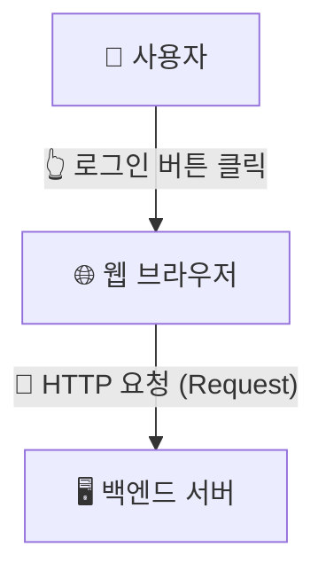

너무 당연한 이야기 같지만, 여기서부터 하나씩 뜯어보자.

---

## "mydomain.co.kr에서 버튼을 누르면 백엔드 서버로 요청이 가요!"

웹에서 브라우저가 서버와 통신할 때는 **HTTP(HyperText Transfer Protocol)**라는 통신 규약을 사용한다.

예를 들어 데이터를 조회한다면:
```http
GET /api/user
```

로그인 정보를 보낸다면:
```http
POST /api/login
Content-Type: application/json

{
  "email": "user@example.com",
  "password": "mypassword123!"
}
```

같은 규격화된 메시지가 만들어짐
`GET`, `POST` 같은 것은 HTTP 메서드(Method)이고, 우리가 버튼을 눌렀을 때 결국 브라우저에서는 이런 식의 **HTTP 요청 메시지**가 만들어져 서버와 통신을 준비한다.


---

## "좋았으 그럼 `mydomain.co.kr`로 요청 보내면 되겠네"

잠시만 🤔
우리가 알고 있는 건 `mydomain.co.kr`이라는 **이름(문자열)**이다.

근데, 네트워크 세상의 장비들이 저 영어로 된 주소를 알 리 없다.
실제 통신을 주고받으려면 **IP 주소(예: 203.0.113.10)**라는 숫자 주소가 필요하다.  
마치 우리가 친구 집에 갈 때 "짱구네 집"이라는 이름만으로는 택시 기사님이 갈 수 없고, "서울시 OO구 OO로 123" 같은 도로명 주소가 필요한 것과 같다.

그러면 지금 쓰고 있는 내 브라우저는:
> "`mydomain.co.kr`이라는 이름을 가진 서버가 어디에 있는지"

어떻게 알 수 있지?  
여기서 등장하는 첫 번째 가이드가 바로 **DNS(Domain Name System)**

---

## DNS: 인터넷 세상의 전화번호부

DNS는 쉽게 말해 **도메인 이름과 IP 주소를 연결해 주는 거대한 전화번호부 시스템**이라 볼 수 있음

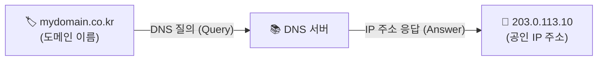

브라우저 주소창에 `mydomain.co.kr`이라고만 쳐도,
브라우저는 뒤편에서 DNS 서버에 먼저 물어본 뒤 `203.0.113.10`이라는 실제 IP 주소를 받아와 통신을 시작한다.

> 💡 **참고: 매번 DNS 서버에 물어볼까?**  
> 브라우저와 OS는 한 번 알아낸 IP 주소를 캐시(DNS Cache)에 저장해 둔다. 그래서 방금 접속했던 사이트라면 DNS 서버에 다시 묻지 않고 로컬 캐시에서 즉시 IP를 꺼내 쓴다!

> "그래? 알겠으니까 203.0.113.10으로 요청을 던지고 나 유튜브 좀 보자"

잠깐, 아직 패킷을 던지기 전에 거쳐야 할 필수 단계가 하나 있다.

---

## 패킷을 보내기 전: 악수부터 합시다 (TCP 3-Way Handshake)


우리가 흔히 쓰는 HTTP(HTTP/1.1, HTTP/2)는 전송 계층의 **TCP(Transmission Control Protocol)** 위에서 동작한다.  
IP 주소를 알았다고 해서 로그인 데이터 상자를 무작정 집어던지는 것이 아니다.  
먼저 상대방 서버가 살아있는지, 나와 대화할 준비가 되었는지 <b>3번의 악수(3-Way Handshake)</b>를 나누며 가상의 통신 선로를 먼저 개설한다.

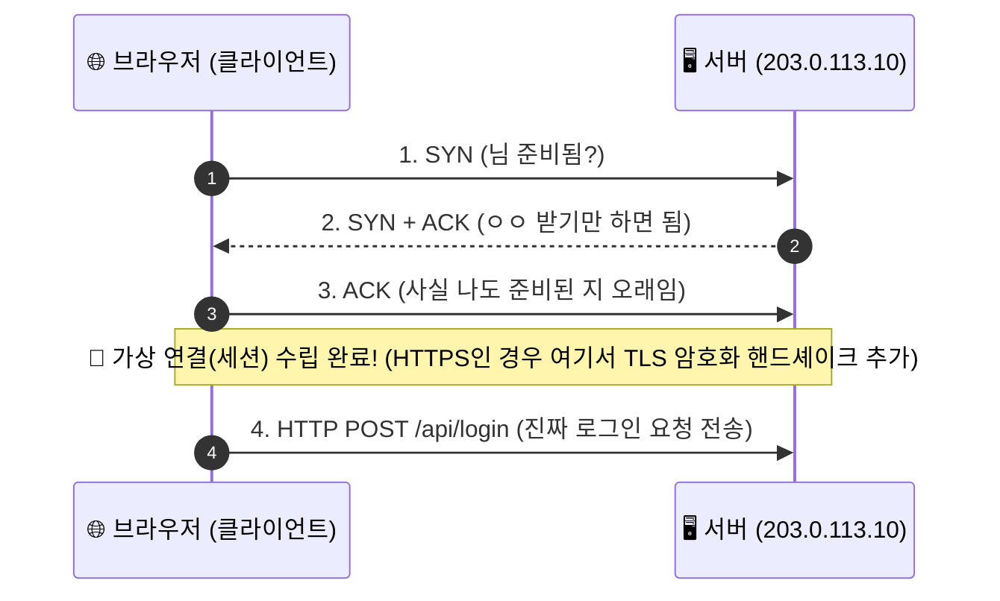

이 통로가 안전하게 열리고 나서야 비로소 우리가 만든 HTTP 로그인 패킷이 서버로 출발한다.


---

## 그런데 잠깐: 이 IP가 바로 WAS 서버의 진짜 IP일까?

우리가 DNS를 통해 알아낸 `203.0.113.10`.  
**이 주소가 정말 Spring Boot나 Node.js가 돌아가는 백엔드 WAS 컴퓨터의 주소일까?**  

꼭 그렇지는 않다.  
실제 서비스 환경에서는 외부에서 보이는 공인 IP(Public IP) 뒤에 수많은 관문과 교통정리 장비들이 버티고 있다.
(*물론 서버별 공인 IP를 가진 곳도 있다.*)

* **로드 밸런서 (Load Balancer)**
* **방화벽 (Firewall)**
* **WAF (웹 방화벽)**
* **NAT 장비**
* **프록시 / CDN**

예를 들어 실제 서비스 환경은 대부분 이런 구조를 띤다.

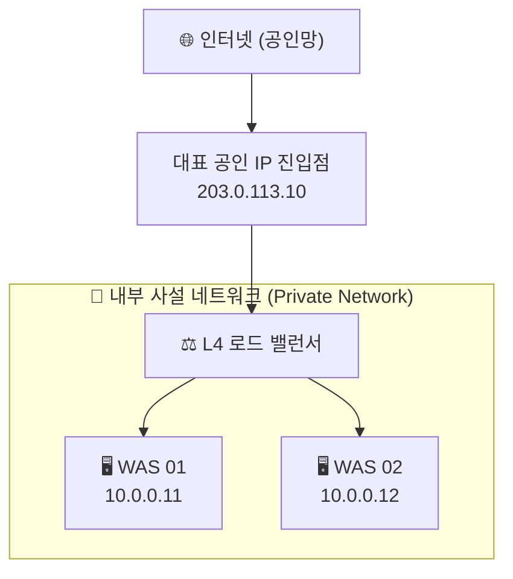

우리는 밖에서 대표 주소인 `203.0.113.10` 하나만 보고 들어왔지만,  
실제 요청을 받아 처리하는 백엔드 서버들은 `10.0.0.11`, `10.0.0.12` 같은 외부에서는 직접 접근할 수 없는 **사설 IP(Private IP)**를 달고 안전한 내부망에 보호받고 있는 것이다.

---

## "잠깐만요, 하나의 IP로 들어왔는데 내부에 서버가 여러 대면 나 어떡하라고"

괜찮다. 우리에겐 포트가 있으니까.

> "203.0.113.10이라는 단 하나의 주소로 들어온 요청을  
> 내부의 10.0.0.11, 10.0.0.12 중에서 어떻게 정확한 서버로 보내는 걸까?"

우리는 <b>IP와 포트(Port)</b>의 관계를 정확히 이해해야 한다.

---

## IP만 있는 게 아님: 아파트 단지와 호수

네트워크 통신에서 목적지를 지정할 때는 항상 **IP와 포트** 쌍을 함께 사용한다.

```text
203.0.113.10:443
(     IP    :포트)
```

비유하자면:
* **IP 주소**: "OO아파트 101동" (어느 컴퓨터 장비인가?)
* **포트 번호**: "702호" (그 컴퓨터 안에서 실행 중인 수많은 프로그램 중 **어느 프로세스**인가?)

컴퓨터 안에는 웹 서버도 돌고 있고, DB도 돌고 있고, 메신저 프로그램도 돌고 있을 수 있다.  
도착한 패킷이 누구에게 전달되어야 할지 창구를 구분해 주는 것이 바로 포트 번호다.

* **HTTP**: 기본 포트 `80`
* **HTTPS**: 기본 포트 `443`

그래서 우리가 브라우저에서 `https://mydomain.co.kr`이라고만 적어도, 내부적으로는 HTTPS 기본 포트인 `443`을 사용하는 통신이 이루어진다.

---

## 그런데 여기서 또 하나의 오해

> "그럼 443번 포트는 WAS 01이고, 444번 포트는 WAS 02고, 이런 식으로 서버가 정해지는 건가요?"

아뇨아뇨아뇨
포트 번호 자체가 물리적인 서버 컴퓨터를 가리키는 것이 아니다.  
공인 IP로 들어온 요청이 내부의 어떤 서버로 연결되는지는 **네트워크 아키텍처(구성 방식)**에 따라 완전히 다르다.

대표적으로 두 가지 방식이 있다.

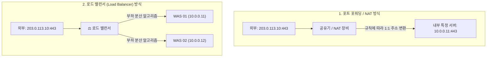

단순한 환경(예: 가정용 공유기)에서는 포트 번호별로 목적지 내부 IP를 1:1로 매핑해 주는 **NAT(포트 포워딩)**을 쓰기도 하지만,  
수많은 사용자가 접속하는 대규모 웹 서비스에서는 같은 443번 포트 요청을 받아 여러 대의 백엔드 서버로 골고루 나누어주는 **로드 밸런서(Load Balancer)**를 사용한다.

---

# 여기서 드디어 L4가 나온다

자. 서버가 여러 대라고 해보자.

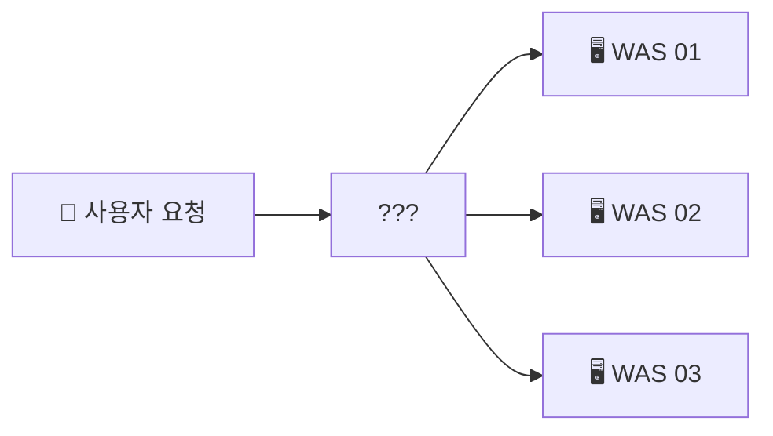

그런데 내 로그인 요청은 **대체 어디로 가야 할까?**  
WAS 01? WAS 02? WAS 03?

모든 사용자의 요청을 1번 서버에만 몰아버리면 굳이 서버를 여러 대 둔 보람이 없을 것이다. 1번 서버만 과부하로 터질 테니까.  
그래서 요청을 여러 서버로 공평하게 나누어 전달하는 **로드 밸런서**가 등장한다.

그중 **L4 로드 밸런서**는 TCP/UDP 같은 전송 계층의 정보(IP, Port)를 바탕으로 연결을 분산한다.

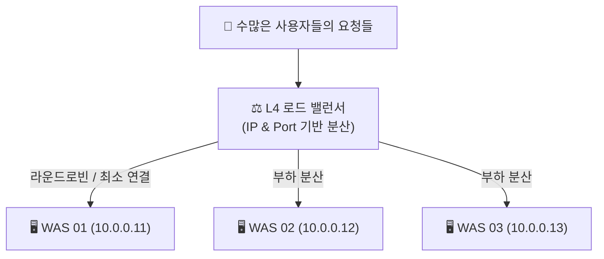

> **왜 이름이 'L4'일까?**  

*[이미지 출처: PromleeBlog](https://www.promleeblog.com/blog/post/278-2-osi-layer)*
> <br>
> OSI 7계층 중 4번째 계층인 <b>전송 계층(Transport Layer)</b>을 다루기 때문이다.  
> L4 로드 밸런서는 패킷 내용(HTTP URL, 본문 JSON 등)까지 일일이 까보지 않고, 오직 <b>IP 헤더와 TCP 포트 헤더</b>만 보고 초고속으로 트래픽을 분산한다.  
> (참고로 HTTP 헤더, 쿠키, URL 경로까지 뜯어보고 분산하는 장비는 7계층 장비인 <b>L7 로드 밸런서 / ALB</b>라고 부른다.)

L4 장비는 단순히 기계적으로만 나누는 것이 아니라:
* **헬스 체크(Health Check)**: 죽어있는 서버가 감지되면 자동으로 제외
* **분산 정책**: 순서대로 나누는 라운드로빈, 연결 수가 가장 적은 서버로 보내는 최소 연결(Least Connection) 등

여러 조건을 따져 최적의 서버를 골라준다.

여기까지 오면 요청의 흐름이 슬슬 보일 것 같다.

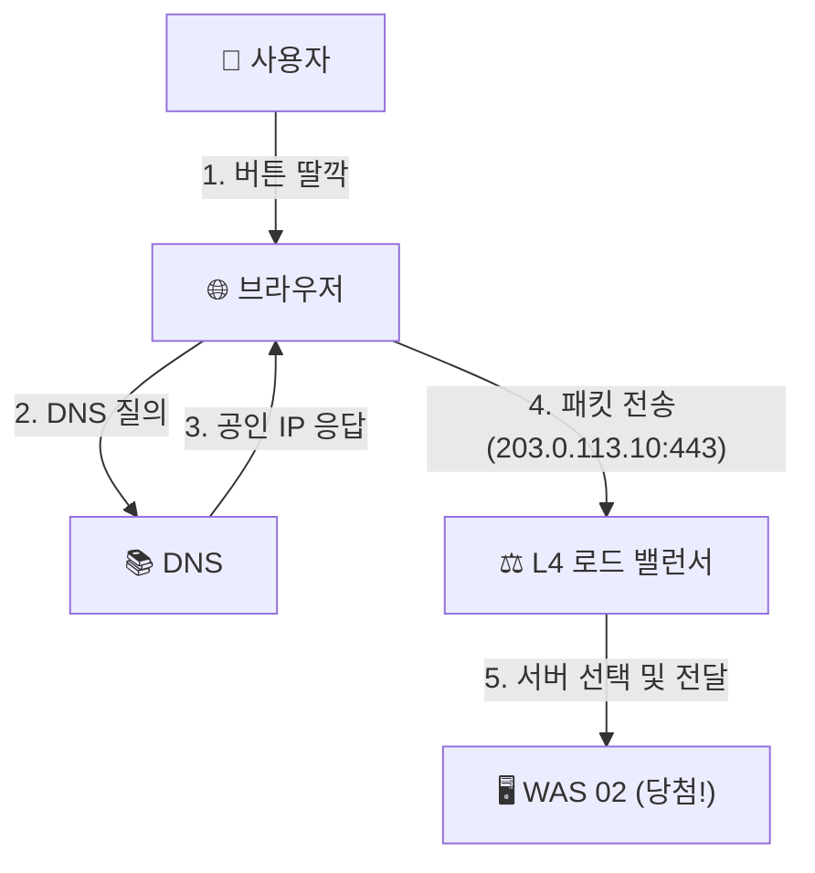


---

# 잠시만요

**L4 다음에 있는 서버까지는 "물리적으로" 어떻게 찾아갈까?**

우리가 인터넷에서 서버를 찾아갈 때는 IP 주소를 사용한다.  
그리고 같은 네트워크 안에서 실제 장비끼리 통신할 때는 **MAC 주소**도 사용한다.

어라?  
그럼 IP도 있고, MAC도 있고, 포트도 있는데... 이것들이 다 필요한 걸까?  
여기서부터 **L4 / L3 / L2**의 협동 플레이가 시작된다.

---

## L3는 무슨 일을 할까? (길 찾기, 라우팅)

L3는 <b>네트워크 계층(Network Layer)</b>이다.  
가장 대표적인 것이 <b>IP와 라우터(Router)</b>다.

쉽게 생각하면:
> **"내가 가야 할 목적지 네트워크 대역이 어디 방향에 있는가?"**

를 판단하는 계층이다.

예를 들어 출발지 네트워크가 `10.0.0.0/24`이고, 목적지가 `20.0.0.0/24`라는 서로 다른 네트워크라면, 중간에서 라우터가 이정표(라우팅 테이블)를 보고 어느 경로로 패킷을 보낼지 길을 찾아주어야 한다.

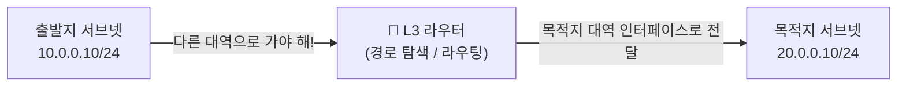

이런 것이 바로 **L3 라우팅**이다.

---

## 그런데 인프라 구성도를 보다 보면 이상한 게 있다?

우리가 장비 구조를 보다 보면 이런 그림을 볼 때가 있다:

```text
L4 ➔ L2 스위치 ➔ WAS 서버
```

어? **L3 라우터는 어디 갔지?**  
혹시 다이어그램에서 생략된 걸까?

---

## 여기서 중요한 것: L3는 무조건 거치는 "필수 통행세"가 아니다

L3 라우터는 무조건 한 번 거쳐야만 하는 장비가 아니다.  
**목적지가 "서로 다른 네트워크 대역"에 있을 때만 라우팅이 필요하다.**

컴퓨터는 패킷을 보낼 때 <b>서브넷 마스크(Subnet Mask)</b>로 계산한다:
* 목적지 IP가 나와 <b>같은 네트워크 대역(동일 서브넷)</b>이라면? ➔ 별도의 L3 라우터를 거치지 않고 **L2 스위칭으로 다이렉트 전달!**
* 목적지 IP가 **다른 네트워크 대역**이라면? ➔ 기본 게이트웨이(**L3 라우터**)로 패킷을 전달해 길을 찾게 함!

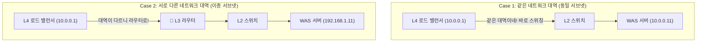

그래서 실제 네트워크를 봤을 때 "L4 다음에 바로 L2로 가는데?"라고 해서 이상한 게 아니다.  
**어떤 네트워크 대역에 목적지가 있는지에 따라 L3 라우팅이 필요한지 결정되기 때문이다.**

---

# 그럼 L2는 머임??(같은 네트워크 안에서의 전달, MAC 주소)

L2는 <b>데이터 링크 계층(Data Link Layer)</b>이다.  
같은 네트워크 안에서 장비를 구분하고 물리적인 신호(프레임)를 전달하는 역할을 한다.  
여기서 등장하는 핵심이 바로 랜카드 고유 번호인 **MAC 주소**다.
 
아주 단순하게 비유하면:

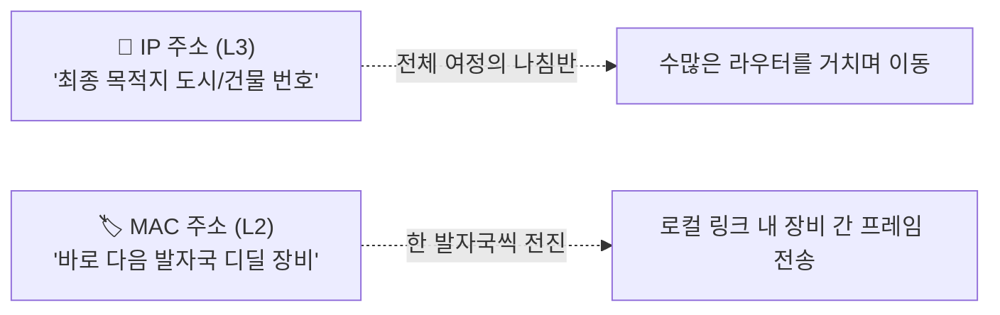

* **IP 주소**: 서울에서 부산까지 갈 때 "부산시 해운대구 OO아파트"라는 **최종 목적지**
* **MAC 주소**: 당장 내 눈앞에 있는 "다음 톨게이트", "다음 교차로"로 가기 위한 **직전 구간의 물리적 하드웨어 주소**

같은 네트워크 안에서 최종 서버로 프레임을 전달할 때는,  
<b>ARP(Address Resolution Protocol)</b>라는 프로토콜을 이용해 "10.0.0.11 쓰는 장비의 MAC 주소가 뭐지?"를 조회한 뒤 그 MAC 주소를 향해 L2 스위치가 프레임을 꽂아준다.

*[ARP 설명은 이 블로그에서](https://velog.io/@seulgi90/ARP%EB%9E%80-%EB%AC%B4%EC%97%87%EC%9D%B8%EA%B0%80)*

---

# 드디어 WAS에 도착!

여기까지 길고 험난한 여정이었다.  
정리하면 우리가 누른 버튼 하나가:

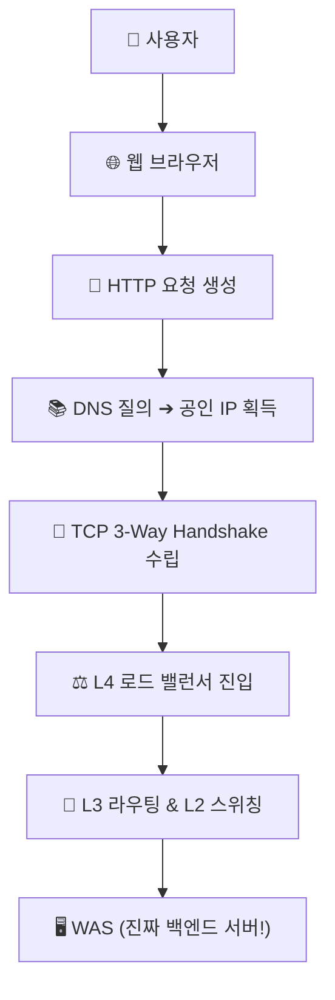

까지 찾아온 것

### 드디어 진짜 백엔드 애플리케이션에 도착했다!!
재밌는 장난...이게 끝이 아니라면...


WAS가 로그인 요청을 받았다면, 이제 <u>"아이디랑 비밀번호가 맞는지 확인"</u>해야 한다.  
그러면 WAS 내부에서도 새로운 2차전이 시작된다.

---

## WAS 안에서도 요청은 계속 흘러간다

예를 들어 우리가 흔히 쓰는 Spring Boot(자바) 환경이라면, 요청은 내부 계층(Layer)을 따라 일사불란하게 흐른다.

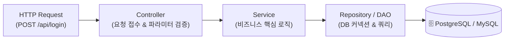

1. **Controller**: "로그인 요청 들어왔네? 이메일과 비밀번호 형식이 올바른지 검증하고 서비스로 넘기자."
2. **Service**: "유저가 입력한 비밀번호가 DB에 저장된 비밀번호랑 맞는지 확인해야겠네. DB에서 유저 정보를 가져와보자!"
3. **Repository**: "커넥션 풀(HikariCP)에서 DB 연결을 하나 빌려서 SQL 쿼리를 날리겠습니다!"

로그인 정보를 조회해야 한다면 이런 순서로 응답이 돌아온다.

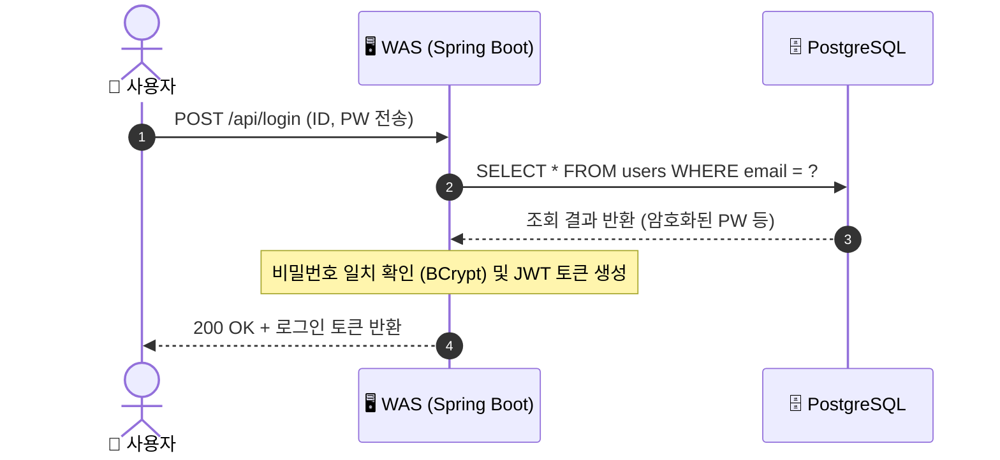

즉, 우리가 브라우저에서 누른 건 그저 작은 버튼 하나였지만,  
실제로는 서버에 도착한 뒤에도 **WAS ➔ DB ➔ WAS ➔ 브라우저**라는 또 다른 요청과 응답이 0.1초도 안 되는 눈 깜짝할 사이에 일어나는 것이다.

> 💡 **참고: DB 서버도 인터넷에 연결되어 있어야 하는 걸까?**  
> 절대 아니다! DB에는 소중한 고객 데이터와 비밀번호가 들어있다. 따라서 DB는 외부 인터넷 공인 IP를 아예 부여하지 않고, 오직 내부망에서 WAS 같은 애플리케이션 서버만 접근할 수 있도록 깊숙한 전용 서브넷에 격리해 둔다.

---

# 서버는 과연 1대씩만 일까?

우리가 지금까지 계속 "WAS 서버"라고 했는데, 진짜 WAS가 평화롭게 한 대만 돌아가고 있을까?  
만약 서버 한 대가 갑자기 죽어버리면...?

---

## 1. WAS 서버 하나가 죽었을 때

로그인 요청을 보내고 있는데 `WAS 01`이 메모리 부족이나 버그로 갑자기 죽어버렸다.  
그러면 내 로그인도 같이 실패해야 할까?

서비스가 중요한데 서버 한 대가 죽었다고 전체 서비스가 멈춘다면 곤란하다.  
그래서 우리는 앞단에 **L4 로드 밸런서**를 두었다!

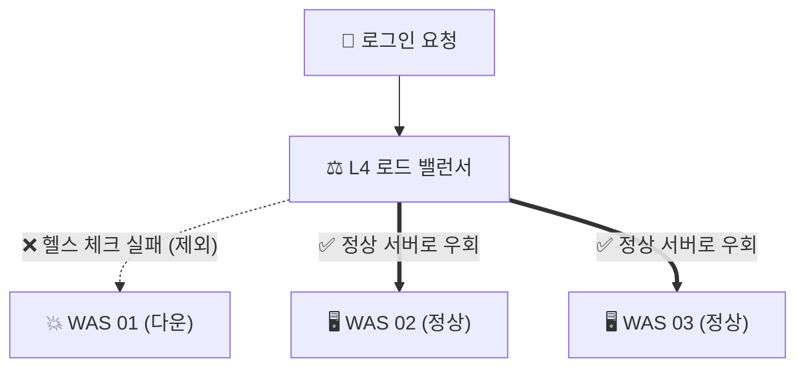

L4는 주기적으로 서버들에게 "너 살아있니?" 하고 안부를 묻는 **헬스 체크(Health Check)**를 수행한다.  
WAS 01이 죽어있으면 목록에서 잽싸게 제외하고, 내 요청을 살아있는 WAS 02나 WAS 03으로 안전하게 전달한다.  
사용자는 서버 한 대가 죽었다는 사실조차 모른 채 안전하게 서비스를 이용할 수 있다.  
이것이 바로 **고가용성(HA, High Availability)**이다.

---

# 그러면 DB는? (진짜 심각한 문제)

여기서 진짜 등골이 서늘해지는 질문이 생긴다.

> **"WAS는 3대인데 DB는 1대면?"**

WAS만 여러 대여도 DB가 한 대뿐이라면:

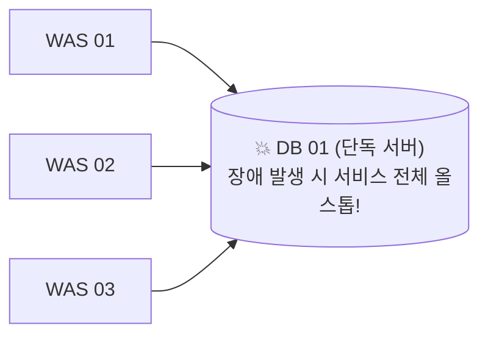

DB 01 한 대가 죽어버리면 모든 WAS가 데이터 조회를 하지 못해 서비스 전체가 마비된다.  
이런 치명타를 시스템 엔지니어링에서는 <b>단일 장애점(SPOF, Single Point of Failure)</b>이라고 부른다.


<br>

그래서 DB 역시 1대만 두지 않고:
* 여러 대로 분산 구성
* **복제 (Replication)**
* **Primary / Standby (주/부) 구조**
* **장애 발생 시 자동 전환 (Failover)**
* **가상 IP (VIP, Virtual IP)**

같은 진화된 아키텍처 개념이 등장하게 된다.

---

# 최종최종최종최종최종최ㅈ... 요약

버튼 누를 땐 아무 생각없긴 했음

```text
👆 버튼 클릭 ➔ 로그인 완료
```

그런데 이 버튼 하나가 실제로는:

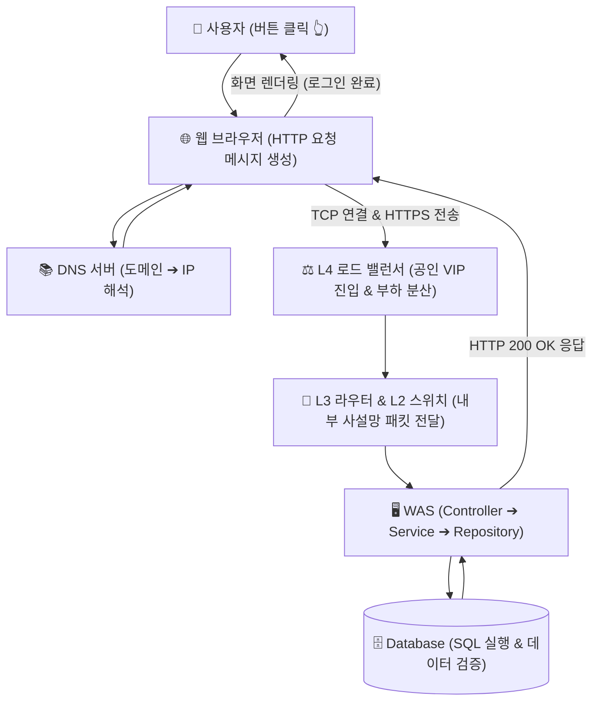

처럼 생각보다 거대하고 정교한 파이프라인을 타고 흘러간다.

처음에는 그냥:
> **버튼 "딸깍" -> 그대로 동작**

라고만 생각했는데, 하나씩 뜯어보니까:
* **"어떤 서버로 가지?"** ➔ DNS와 공인 IP
* **"대화 통로는 어떻게 열지?"** ➔ TCP 3-Way Handshake
* **"서버가 여러 대면?"** ➔ L4 로드 밸런서
* **"장비끼리 어떻게 찾아가지?"** ➔ L3 라우팅과 L2 MAC 스위칭
* **"도착해서 무슨 일을 하지?"** ➔ WAS 프레임워크와 비즈니스 로직
* **"서버가 죽으면?"** ➔ 로드 밸런서의 헬스 체크와 이중화

라는 탄탄한 톱니바퀴 구조가 조금씩 보이기 시작한다.

---

## 그리고...


> **"흠 잠깐만"**  
> DB가 2대라면, **지금 어느 DB가 쓰기(Insert/Update)를 처리하고 있는지** 애플리케이션은 어떻게 알죠?  
> 그리고 **DB 01이 죽으면 DB 02가 알아서 대신 처리할 수 있을까요?**

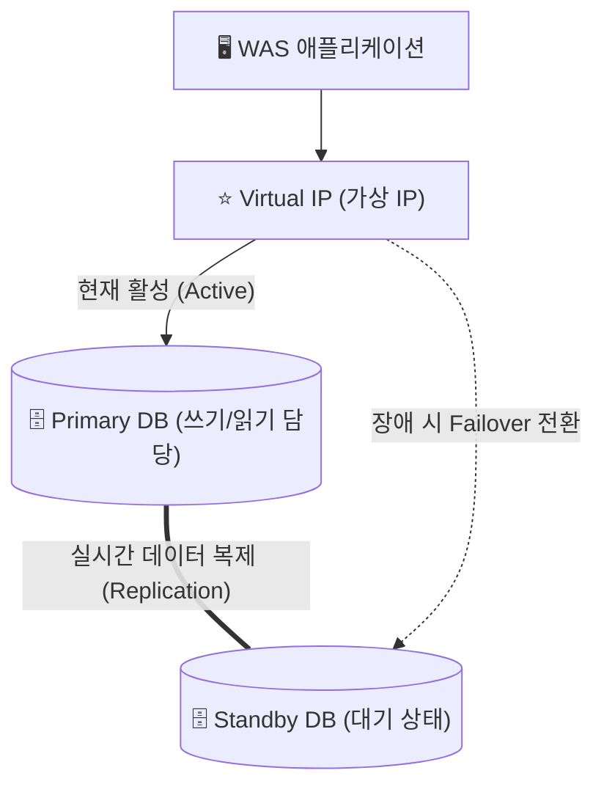

여기서부터는 시스템 엔지니어링의:
* **Replication (데이터 복제)**
* **Primary / Standby**
* **Failover (자동 장애 조치)**
* **VIP (Virtual IP)**

라는 조금 더 깊게 들어간다.

다음 글에서는:
> **"그럼 서버는 왜 굳이 여러 대로 나눠놓는 걸까?"**

부터 시작해서 **Web / WAS / DB / Bastion**이 각각 무슨 일을 하는지,  
그리고 DB를 두 대로 구성하면 실제로 어떻게 이중화가 되어 장애를 견뎌내는지까지 알아보는게 좋을 것 같다.
