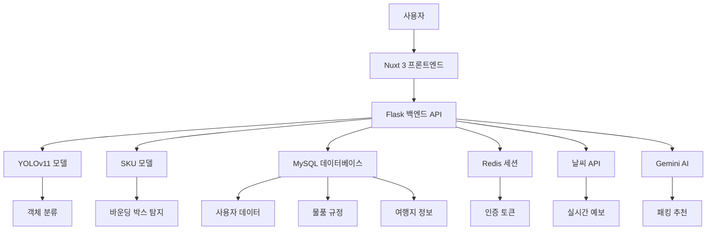

# 🛫 PassCheckers: 여행의 시작을 가볍게

## 1. 프로젝트 개요 (Background)

### "146톤의 낭비를 막아라"
포스트 코로나 시대, 여행 수요가 폭발하면서 공항 보안 검색대는 매일 전쟁터가 됩니다. 여행자들이 기내 반입 금지 물품을 제대로 인지하지 못해 수하물을 포기하는 사례가 빈번하기 때문입니다. 실제로 **2024년 하반기 기준, 약 146톤의 여객 포기 물품이 발생**했습니다.

**PassCheckers**는 이 문제를 해결하기 위해 개발된 **AI 기반 수하물 분류 및 통합 여행 도우미**입니다. 사용자가 짐 사진을 찍어 올리기만 하면, AI가 물품을 식별하고 규정을 판별하여 무게까지 예측해주는 시스템을 구축했습니다.

---

## 2. 기술 스택 및 아키텍처 (Tech Stack & Architecture)

### 🔧 기술 스택

|  분류   | 기술 |
|:--------:|:-----:|
| 프론트엔드 | Nuxt 3, Vue 3, TypeScript, Quasar UI |
| 백엔드 | Python 3.10, Flask 3.1 |
| 모델 | YOLOv11 (커스텀 학습) |
| 데이터베이스 | MySQL 8.0 |
| 인프라 | Nginx |
| 기타 | OpenCV, Numpy, Pillow, Redis, PyTorch, TensorRT |

### 🧭 시스템 아키텍처

PassCheckers는 마이크로서비스 지향적인 모듈형 아키텍처를 채택했습니다. 프론트엔드와 백엔드를 철저히 분리하고, AI 추론 엔진과 외부 데이터 서비스(날씨, Gemini)를 독립적으로 관리합니다.



---

## 3. 핵심 기능 개발 (Key Features & Implementation)

제가 주도적으로 설계하고 개발한 핵심 기능들입니다. 특히 AI 모델의 추론 결과를 실제 사용자 경험(UX)으로 녹여내는 데 집중했습니다.

### ① 2-Stage AI 파이프라인과 데이터 보정 (Luggage Classification)

수하물 사진은 작은 물건들이 겹쳐져 있는 경우가 많아 단일 모델로는 한계가 있습니다. 이를 해결하기 위해 **이중 탐지 파이프라인**을 구축하고, 탐지 후 데이터를 정제하는 로직을 개발했습니다.

1.  **SKU Model (Localization):** 이미지 내에서 '객체'가 있을 법한 위치(Bounding Box)를 1차적으로 정밀하게 탐지합니다.
2.  **YOLOv11x (Classification):** 탐지된 영역을 Crop하여 44개 클래스로 학습된 모델로 정밀 분류합니다.
3.  **Fuzzy Matching:** AI가 영어로 탐지한 결과(예: "portable-charger")를 DB의 한국어 규정 데이터("보조배터리")와 매칭하기 위해 `RapidFuzz` 라이브러리를 활용한 유사도 검증 로직을 구현했습니다.

> **💡 미탐/오탐 해결책:** AI가 100% 완벽할 수는 없기에, 사용자가 직접 BBox를 수정하거나 추가할 수 있는 에디터를 구현했습니다. 사용자가 물품을 추가할 때 DB에 있는 유사 물품을 추천해주어 데이터 정합성을 유지했습니다.

```python
# backend/matching/item_service.py (Fuzzy Matching Snippet)
def find_best_match(self, query, threshold=30):
    """입력된 쿼리와 가장 유사한 물품을 찾습니다."""
    # RapidFuzz를 사용하여 유사도 점수 계산
    result = process.extractOne(query, self.item_names, scorer=fuzz.WRatio, score_cutoff=threshold)
    if result:
        match_name, score, _ = result
        return { "name": match_name, "score": round(score, 2), "id": item_id }
    return None
```

### ② 인터랙티브 패킹 & 규정 가이드 (Interactive Packing)

분석된 결과를 단순히 보여주는 것을 넘어, 사용자가 짐을 싸는 행위 자체를 디지털화했습니다.

*   **Drag & Drop UI:** `vuedraggable`을 활용해 분석된 물품을 '기내 가방'과 '위탁 가방'으로 직관적으로 분류할 수 있게 했습니다.
*   **실시간 규정 검사:** 보조배터리를 위탁 수하물로 옮기면 즉시 **경고 모달**이 뜨고, 칼과 같은 금지 물품은 아예 드래그가 불가능하도록 막았습니다.
*   **패킹 요약 플로팅 윈도우:** 스크롤을 내려도 현재 패킹 상태를 한눈에 볼 수 있는 플로팅 UI를 구현했습니다.

```javascript
// frontend/pages/packing.vue (Rule Checking Logic)
const checkRules = (item, targetListType) => {
    if (targetListType === 'carry-on') {
        // 기내 반입 불가 항목 체크
        return item.carry_on_allowed !== '아니요';
    }
    if (targetListType === 'checked') {
        // 위탁 수하물 불가 항목 체크 (예: 보조배터리)
        return item.checked_baggage_allowed !== '아니요';
    }
    return true;
};
```

### ③ 하이브리드 무게 예측 시스템 (Weight Prediction)

가장 고민이 많았던 기능입니다. 사진만으로 무게를 맞추는 것은 매우 어렵기 때문에 **통계적 방법**과 **AI 추론**을 결합한 하이브리드 방식을 고안했습니다.

1.  **데이터베이스 구축:** 주요 물품의 평균 무게(Avg)와 범위(Min-Max) 데이터를 직접 구축했습니다. (kg/g 단위 구분)
2.  **1차 추론 (Statistical):** 이미지 내 객체의 `BBox Ratio`(면적 비율)를 계산하여, 크기가 크면 무게 범위의 상한값, 작으면 하한값으로 보정하는 알고리즘을 적용했습니다. 특히 가방류는 크기에 따른 무게 편차가 크므로 보수적으로(무겁게) 예측하도록 가중치를 두었습니다.
3.  **2차 보강 (Generative AI):** DB에 없는 신규 물품은 `Gemini API`를 호출하여 예상 무게와 카테고리를 실시간으로 받아와 DB를 업데이트합니다.
4.  **시각화:** `ApexCharts`를 활용해 카테고리별 무게 분포를 시각화하고, 총 무게에 따른 적정 캐리어 사이즈를 추천해줍니다.

### ④ 수하물 공유 & 동반자 연결 (Social Sharing)

"짐 싸기"를 소셜 활동으로 확장했습니다.

*   **공유 코드 시스템:** 분석 기록마다 고유 코드를 생성하여 친구를 초대할 수 있습니다.
*   **실시간 동기화:** 호스트와 클라이언트 구조로 연결되어, 서로의 짐 목록을 확인하고 "이건 내가 챙길게"와 같은 댓글을 남길 수 있습니다.
*   **UI/UX:** 여러 명의 짐을 효율적으로 보여주기 위해 **캐러셀(Carousel)** UI를 채택하여 직관성을 높였습니다.

---

## 4. 기술적 도전과 해결 (Challenges & Solutions)

### 🚀 TensorRT를 통한 추론 속도 최적화
초기 YOLOv11 모델은 정확도는 높았지만 추론 속도가 느려 웹 서비스에 부적합했습니다. 이를 해결하기 위해 PyTorch 모델(.pt)을 ONNX로 변환 후, **TensorRT 엔진(.engine)**으로 빌드하여 최적화했습니다. 그 결과 추론 속도를 획기적으로 단축하여 실시간에 가까운 분석 경험을 제공할 수 있었습니다. (관련 기록: `TRT엔진 생성 독스.txt`)

### 💾 효율적인 DB 설계와 협업
팀원들이 각자 기능을 개발하면서 DB 스키마가 빈번하게 변경되는 문제가 있었습니다.
*   **해결:** `app.py` 구동 시 DB 테이블과 컬럼을 검사하고, 변경 사항이 있으면 자동으로 마이그레이션(ALTER TABLE)하는 로직을 구축하여 팀원 간 개발 환경 동기화 문제를 해결했습니다. 또한 무게 예측을 위해 `weight_unit`과 `category` 컬럼을 정규화하여 데이터 일관성을 확보했습니다.

### ⚖️ 무게 예측의 신뢰성 확보
Gemini API에만 의존했을 때 환각 현상(터무니없는 무게 예측)이 발생하는 문제가 있었습니다.
*   **해결:** `weights` 테이블을 직접 구축하여 "통계 기반 계산"을 1순위로 두고, DB에 없는 물품에 대해서만 Gemini를 사용하는 **Fallback 전략**을 취했습니다. 이를 통해 예측의 안정성을 확보하면서도 확장성을 놓치지 않았습니다.

---

## 5. 회고 (Retrospective)

이 프로젝트를 통해 **RESTful API** 설계 원칙을 깊이 있게 이해하고 준수하려 노력했습니다. 특히 프론트엔드(Vue.js)와 백엔드(Flask)가 명확하게 분리된 환경에서 데이터를 주고받으며, **상태 관리**와 **비동기 처리**의 중요성을 체감했습니다.

또한, 단순히 AI 모델을 돌리는 것을 넘어, **"사용자가 이 결과를 어떻게 받아들이고 활용할까?"**를 끊임없이 고민하며 `에디터`, `경고 모달`, `공유 기능` 등 사용자 친화적인 기능을 구현하는 데 많은 공을 들였습니다. 기술적으로는 최신 모델인 YOLOv11과 TensorRT, 생성형 AI(Gemini)를 적재적소에 융합하여 실용적인 서비스를 만들어낸 경험이 큰 자산이 되었습니다.
