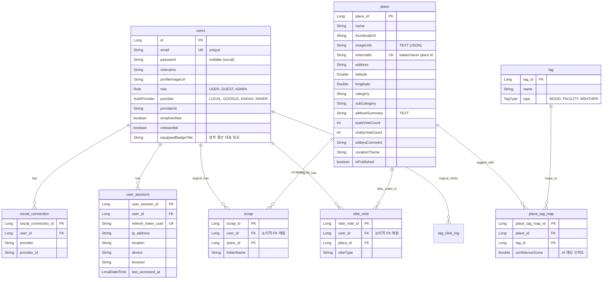
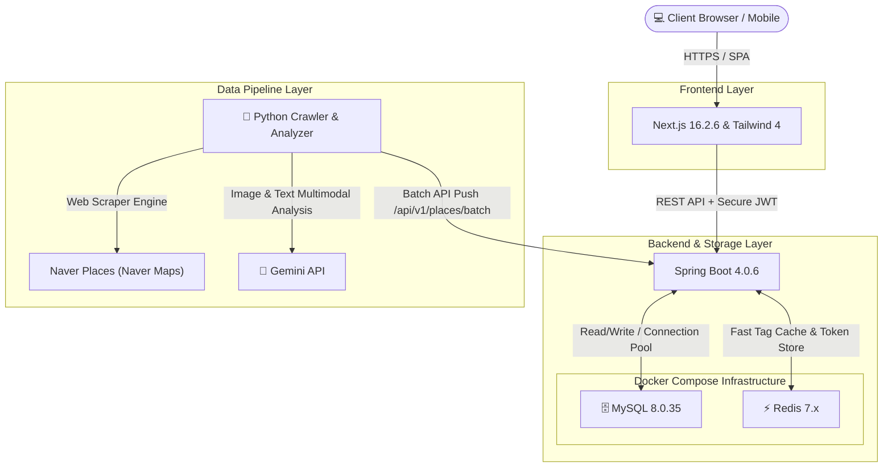

## 프로젝트 개요

> **"오늘 내 기분에 꼭 맞는 공간을 쇼핑하듯 탐색해 보세요."**

스마트폰 클릭 몇 번으로 수많은 맛집과 카페 정보를 찾을 수 있는 시대입니다. 하지만 정작 <strong>'집중해서 작업하기 좋은 잔잔한 북카페'</strong>나 <strong>'해질녘 노을이 잘 보이는 이색적인 야외 테라스'</strong>처럼 내 마음에 꼭 맞는 구체적인 무드의 공간을 찾기란 여전히 쉽지 않습니다.

<strong>픽플(PickPl)</strong>은 이 번거로움을 해결하기 위해 탄생한 **AI 기반 감성 무드 큐레이션 공간 룩북 플랫폼**입니다. 단순한 포털 검색 방식을 넘어, 실제 방문자 리뷰와 공간의 이미지 데이터를 AI 에이전트가 정밀 분석하여 독자적인 감성 지표를 도출합니다. 인스타그램 피드를 넘기듯 직관적으로 공간을 발견하고, 실시간 날씨와 내 활동 통계에 기반한 맞춤형 공간 추천 서비스를 경험해 보세요.

---

## 프로젝트 구조

프론트엔드, 백엔드 및 AI 데이터 파이프라인 모듈이 느슨한 결합(Loose Coupling)으로 설계되어 데이터 수집/가공과 서비스 서빙이 완벽히 분리되어 동작합니다.

```text
pickpl/
├── backend/                            # Spring Boot 백엔드
│   ├── src/main/java/com/pickpl/app/
│   │   ├── auth/                       # OAuth2, 다중 기기 세션 관리
│   │   ├── config/                     # Security, CORS 설정
│   │   ├── domain/                     # JPA 엔티티 및 리포지토리 레이어
│   │   ├── place/                      # 공간 검색, 페이징, 카테고리 로직
│   │   ├── scrap/                      # 스크랩 폴더 및 매핑
│   │   └── user/                       # 대시보드 통계 및 3D 뱃지 업적 관리
│   └── build.gradle
├── frontend/                           # Next.js 프론트엔드
│   ├── api/                            # Axios 인터셉터 및 동적 URL 설정
│   ├── app/                            # Onboarding, Admin 등 App Router 페이지
│   ├── components/                     # 발견 피드, 검색, 마이페이지 뷰 컴포넌트
│   └── store/                          # Zustand 전역 상태 관리 (Auth, Location)
└── data-pipeline/                      # Python 기반 AI 수집 파이프라인
    ├── scraper/                        # Playwright 기반 Naver Place 크롤러
    ├── analyzer/                       # Gemini API 기반 감성 분석기
    ├── loader/                         # 백엔드 RDB 데이터 벌크 로더
    ├── utils/                          # Tkinter 스레드 세이프 GUI 모니터
    └── main.py                         # 파이프라인 진입점 (Resume 지원)
```

---

## 기술 스택 및 아키텍처

| 분류 | 기술 |
|:--------:|:-----:|
| **Frontend** | Next.js, React, TypeScript, SWR, Zustand, TailwindCSS |
| **Backend** | Spring Boot, Java, Spring Security, Spring Data JPA, QueryDSL |
| **Database** | MySQL (RDB 데이터 영속), Redis (다중 세션 캐시) |
| **AI / Pipeline** | Gemini 1.5 & 2.5 Flash, Playwright, BeautifulSoup, Tkinter |
| **Geo API** | W3C Geolocation API, Open-Meteo Weather API |

### 📊 데이터베이스 ERD (논리적 FK 설계 기법)
성능 격리 및 추후 마이크로서비스 아키텍처(MSA)로의 데이터베이스 물리적 확장을 고려하여 물리적인 외래키(FK) 대신, `Scrap` 및 `VibeVote` 등의 비정형 성격 도메인은 애플리케이션 레벨에서 논리적 FK 관계로 제어하도록 설계했습니다. `Place`와 `Tag`는 N:M 관계의 유연성을 위해 `PlaceTagMap` 중간 매핑 테이블을 거칩니다.





---

## UI/UX 특징

모바일 화면에 최적화된 앱 스타일의 레이아웃으로 기획되었으며, 픽플 특유의 오렌지 브랜드 톤앤매너와 미니멀하고 직관적인 조작감을 제공합니다.

#### [사용자 애플리케이션 화면]

<ImageCarousel
  aspectRatio="auto"
  images={[
    {
      src: "/images/projects/pickpl/login.png",
      alt: "로그인 페이지",
      caption: "픽플의 브랜드 아이덴티티가 담긴 로그인 화면"
    },
    {
      src: "/images/projects/pickpl/ouathRegister.png",
      alt: "소셜 계정 전용 회원가입",
      caption: "소셜 계정 간편 로그인 시 첫 로그인 유저의 닉네임을 설정하는 페이지"
    },
    {
      src: "/images/projects/pickpl/1stLoginOnboarding.png",
      alt: "취향 온보딩",
      caption: "첫 로그인 시 선호 무드 태그를 선택하여 개인화 추천 가중치를 설정하는 스킵 가능 온보딩"
    },
    {
      src: "/images/projects/pickpl/main.png",
      alt: "메인 페이지",
      caption: "인스타 피드 스타일 공간 카드를 스크롤로 무한 탐색하는 메인 화면"
    },
    {
      src: "/images/projects/pickpl/search.png",
      alt: "검색 페이지",
      caption: "세부 무드 태그와 위치 반경 조합으로 장소를 필터링하는 검색 화면"
    },
    {
      src: "/images/projects/pickpl/curationPage.png",
      alt: "큐레이션 페이지",
      caption: "메인 우측 상단 큐레이션 배너 클릭 시 진입하는 날씨 및 계절 맞춤형 공간 기획전 목록"
    },
    {
      src: "/images/projects/pickpl/mainModal.png",
      alt: "장소 모달 1",
      caption: "카드를 누르면 열리는 상세 모달로 사진, 태그, 네이버 지도 바로가기, 실시간 투표 및 방문 기록 조회 제공"
    },
    {
      src: "/images/projects/pickpl/mainModal2.png",
      alt: "장소 모달 2",
      caption: "장소 상세 모달의 다른 정보 구성 예시 예시 화면"
    },
    {
      src: "/images/projects/pickpl/scrap.png",
      alt: "스크랩 바텀시트",
      caption: "장소 스크랩 시 노출되는 스크랩 보관함 바텀 시트"
    },
    {
      src: "/images/projects/pickpl/myScrap.png",
      alt: "내 스크랩 화면",
      caption: "분위기 폴더별 스크랩 관리, 폴더 생성 및 보관, 이름 변경 및 삭제 지원"
    }
  ]}
/>

#### [마이페이지 화면]

<ImageCarousel
  aspectRatio="auto"
  images={[
    {
      src: "/images/projects/pickpl/mypageDash.png",
      alt: "마이페이지 대시보드",
      caption: "사용자 활동 로그 기반 선호 분위기 분석 통계 대시보드가 노출되는 마이페이지 메인"
    },
    {
      src: "/images/projects/pickpl/oauthLogined.png",
      alt: "SNS 로그인 마이페이지",
      caption: "SNS 계정으로 로그인한 유저 전용 마이페이지 노출 형태"
    },
    {
      src: "/images/projects/pickpl/mypageBadge.png",
      alt: "마이페이지 속 업적",
      caption: "활동 지표 달성에 따라 3D 피규어 캐릭터 뱃지를 해금하는 업적 도감 화면"
    },
    {
      src: "/images/projects/pickpl/mypagePickplSetting.png",
      alt: "마이페이지의 픽플 설정",
      caption: "프로필 변경 및 소셜 계정 연동 상태를 확인하는 관리 페이지"
    },
    {
      src: "/images/projects/pickpl/myPageAccount.png",
      alt: "계정 설정 화면",
      caption: "이메일 인증을 연동하고 연동된 계정 정보를 수정 및 탈퇴하는 설정 화면"
    },
    {
      src: "/images/projects/pickpl/mypageLoginHistory.png",
      alt: "계정 로그인 기록",
      caption: "접속한 장비 리스트 및 IP 주소를 실시간 트래킹하고 좀비 세션 원격 로그아웃 지원"
    },
    {
      src: "/images/projects/pickpl/emailButton.png",
      alt: "이메일 인증 요청",
      caption: "계정 인증용 6자리 코드 발송을 요청하는 이메일 인증 발송 버튼"
    },
    {
      src: "/images/projects/pickpl/emailCodeInput.png",
      alt: "이메일 코드 입력창",
      caption: "메일로 발송된 6자리 임시 인증 번호를 기입하는 검증창"
    },
    {
      src: "/images/projects/pickpl/emailCodeHTML.png",
      alt: "이메일 SMTP 커스텀 본문",
      caption: "실제 SMTP 프로토콜로 전송되는 픽플 커스텀 디자인 HTML 메일 본문"
    },
    {
      src: "/images/projects/pickpl/myprofileEdit.png",
      alt: "프로필 수정 페이지",
      caption: "이메일 본인인증 완료 후에만 접근 및 변경이 가능한 마이페이지 프로필 수정 화면"
    }
  ]}
/>

#### [데이터 수집 화면]

<ImageCarousel
  aspectRatio="auto"
  images={[
    {
      src: "/images/projects/pickpl/scrapGUI.png",
      alt: "수집 파이프라인 GUI 모니터",
      caption: "Playwright 크롤러와 Gemini AI 분석 진행 상황을 실시간 그래프와 로그 스트리밍으로 모니터링하는 Tkinter 데스크톱 앱"
    }
  ]}
/>

#### [관리자(CMS) 화면]

<ImageCarousel
  aspectRatio="auto"
  images={[
    {
      src: "/images/projects/pickpl/adminLogin.png",
      alt: "어드민 로그인 페이지",
      caption: "서비스 전체 데이터 관리를 위한 보안 관리자 로그인"
    },
    {
      src: "/images/projects/pickpl/cmsUpload.png",
      alt: "JSON 데이터 검토 페이지",
      caption: "수집 완료된 raw 장소 데이터를 CMS 데이터베이스 로드를 위해 파일 적재 준비하는 화면"
    },
    {
      src: "/images/projects/pickpl/cmsUpload1.png",
      alt: "수집 데이터 벌크 적재",
      caption: "분석 완료된 JSON 파일을 드래그 앤 드롭으로 브라우저에 투척하여 데이터베이스에 벌크 업로드"
    },
    {
      src: "/images/projects/pickpl/cmsPlaceManage.png",
      alt: "공간 데이터 매니지먼트",
      caption: "데이터 목록을 일괄 검토하고 개별 장소를 클릭하여 세부 항목을 자유롭게 수정"
    },
    {
      src: "/images/projects/pickpl/cmsPlaceModal.png",
      alt: "장소 상세 편집 모달",
      caption: "공간 관리 페이지에서 목록을 클릭했을 때 뜨는 상세 정보 및 AI 키워드 큐레이션 교정 팝업창"
    },
    {
      src: "/images/projects/pickpl/cmsCuration.png",
      alt: "룩북 기획전 테마 관리",
      caption: "기상 조건 오작동 대비 수동 배너 강제 노출 설정(Force) 및 기획전 테마 등록 제어"
    },
    {
      src: "/images/projects/pickpl/cmsReview.png",
      alt: "리뷰 및 방문기록 관리",
      caption: "픽플 사용자들이 등록한 방문 기록 및 영수증 인증 고객 리뷰 데이터를 관리"
    },
    {
      src: "/images/projects/pickpl/cmsDashboard.png",
      alt: "CMS 대시보드",
      caption: "전체 활성 장소, 대기 건수, 전체 태그 및 누적 로그 분석 지표 관리 대시보드"
    },
    {
      src: "/images/projects/pickpl/cmsSetting.png",
      alt: "관리자 환경 설정",
      caption: "어드민 전용 시크릿 키 설정 및 서비스 전반 환경 설정 테이블"
    }
  ]}
/>

---

## 주요 기능

#### 1. 감성 무드 룩북 피드 및 다중 필터 검색
- 인스타 피드 방식의 직관적인 무한 스크롤 탐색으로 사용자 관심 유도
- 조용한(Cozy), 힙한(Hip) 등 주요 무드 분류와 실시간 GPS 거리를 연계한 취향 필터링 기능 제공

#### 2. 개인화 큐레이션 보관함
- 폴더 단위(예: '작업하기 좋은 카페')로 마음에 드는 분위기를 모아 분류하는 룩북형 보관 지원
- 수집된 상점 사진들을 활용해 콜라주 형태의 폴더 커버 아트를 프론트단에서 자동 생성

#### 3. 3D 캐릭터 뱃지 도감 및 대표 칭호 시스템
- 유저 활동 지표를 분석해 무드 피규어 컨셉의 뱃지를 해금하는 게이미피케이션 탑재
- 원하는 획득 뱃지를 대표 프로필 칭호로 장착해 기기 다중 접속 시에도 실시간 동기화

#### 4. 로그인 기기 다중 세션 관리
- 현재 접속 중인 디바이스 정보(OS, 브라우저명, IP 주소)를 수집하여 마이페이지 세팅 화면에 노출
- 로그인한 유저 본인이 타 기기의 좀비 세션을 원격 강제 로그아웃시키는 보안 보강 기법 적용

#### 5. 지능형 데이터 수집 및 AI 분석 파이프라인
- Python 가상환경 내 Playwright 비동기 크롤러 엔진을 활용해 외부 네이버 플레이스의 평점, 상점 사진, 방문자 텍스트 리뷰 수집
- Gemini API 연동을 통해 수집한 텍스트 데이터의 감성을 구조화된 룩북 요약 JSON 포맷으로 실시간 파싱

#### 6. 관리자 백오피스 (CMS)
- CMS 대시보드를 활용해 수집된 전체 장소, 퍼블리시 대기 데이터 건수, 전체 태그 및 누적 로그 분석 지표를 일괄 관리
- 어드민 공간 관리/승인 폼 제어 및 테마별 룩북 기획전 설정, 분석 완료 JSON 파일의 드래그앤드롭 벌크 적재

---

## 핵심 기술

#### 1. 실시간 날씨 및 계절별 큐레이션
* **채택 사유**: 비가 오거나 특정 계절, 혹은 요일별 시간대에 알맞은 감성 룩북 배너를 자동으로 판단하여 노출시켜야 합니다
* **설계 포인트**: 클라이언트 측 위경도를 기반으로 외부 Open-Meteo API 기상 데이터를 실시간 파싱합니다. 날씨가 비(`RAINY`)일 때는 `rainy_indoor`(비 오는 날 실내 공간) 기획전을 최우선 노출하고, 맑을 때는 주말 낮 `pet_friendly`(반려견 나들이) 또는 평일 낮 `wellness`(웰니스 다도) 기획전을 무작위 게릴라 매칭하거나, 기본값으로 계절 필터(`spring`, `summer`, `autumn`, `winter`) 큐레이션 배너를 노출하는 제어 판정 트리를 구현했습니다
```java
// backend/src/main/java/com/pickpl/app/curation/service/CurationService.java
@Transactional(readOnly = true)
public CurationResponse getCuration(Long userId, Double latitude, Double longitude) {
    // 1. 기상 Open API 호출 및 현재 시간 수립
    String weatherState = weatherClient.getWeatherState(latitude, longitude);
    java.time.LocalDateTime now = java.time.LocalDateTime.now();
    java.time.DayOfWeek day = now.getDayOfWeek();
    int hour = now.getHour();
    int currentMonth = now.getMonthValue();
    String curationThemeKey;

    // 2. 날씨/시간대/계절 판정 매트릭스 트리 작동
    if ("RAINY".equals(weatherState)) {
        curationThemeKey = "rainy_indoor"; // 비 오는 날 큐레이션 배너 고정
    } else if ("SNOWY".equals(weatherState)) {
        curationThemeKey = "winter";
    } else {
        if ((day == java.time.DayOfWeek.FRIDAY || day == java.time.DayOfWeek.SATURDAY) && (hour >= 17 || hour <= 2)) {
            curationThemeKey = "night_market"; // 주말 저녁 야장 노포 테마
        } else if ((day == java.time.DayOfWeek.SATURDAY || day == java.time.DayOfWeek.SUNDAY) && (hour >= 9 && hour < 17)) {
            curationThemeKey = "pet_friendly"; // 주말 낮 애견동반 게릴라 테마
        } else if ((day == java.time.DayOfWeek.MONDAY || day == java.time.DayOfWeek.TUESDAY || day == java.time.DayOfWeek.WEDNESDAY || day == java.time.DayOfWeek.THURSDAY) && (hour >= 13 && hour < 17)) {
            curationThemeKey = "wellness"; // 평일 낮 다도/웰니스 차분한 테마
        } else {
            // 그 외 기본 달(Month)에 기반한 계절 배너 노출
            if (currentMonth >= 3 && currentMonth <= 5) curationThemeKey = "spring";
            else if (currentMonth >= 6 && currentMonth <= 8) curationThemeKey = "summer";
            else if (currentMonth >= 9 && currentMonth <= 11) curationThemeKey = "autumn";
            else curationThemeKey = "winter";
        }
    }
    
    List<PlaceSummaryResponse> places = java.util.Collections.emptyList();
    if (curationThemeKey != null) {
        places = placeService.findPlacesByCurationTheme(curationThemeKey, userId, latitude, longitude);
    }
    return CurationResponse.of(activeThemeTitle, activeThemeName, places);
}
```

#### 2. 개인화 하이브리드 추천 엔진 (JPA & Redis & Time Decay)
* **채택 사유**: 사용자가 플랫폼 내에서 행동하는 패턴 자체를 취향 가중치 벡터로 가공하여, 기호에 밀접하게 맞닿은 장소들을 우선 노출시킵니다
* **설계 포인트**: Redis 캐시 LookUp 연동을 통해 사용자의 선호 가중치 맵을 로드합니다. 온보딩 가중치(`+5.0`), 상세 조회 로그(`최근 50개`, 개당 `+1.0`), 분위기 투표(`+2.0`) 점수를 합산해 취향 벡터를 생성하고, 최신 핫플 가점을 위해 `Math.exp(-0.05 * 경과일수)` 지수 시간 감쇠 공식을 곱해 최종 점수를 산출합니다
```java
// backend/src/main/java/com/pickpl/app/place/service/RecommendationService.java
@Transactional(readOnly = true)
public RecommendationResponse getPersonalizedRecommendations(Long userId) {
    if (userId == null) return getPopularFallback();
    
    // 1. Redis 캐시 또는 DB를 조회하여 사용자의 취향 가중치 벡터 맵을 획득
    Map<String, Double> userPreferences = getUserPreferenceVector(userId);
    if (userPreferences.isEmpty()) return getPopularFallback();

    // 2. 가장 선호도가 높은 주요 무드 및 상위 태그 추출
    String primaryMood = userPreferences.entrySet().stream()
            .max(Map.Entry.comparingByValue())
            .map(Map.Entry::getKey).orElse(null);

    List<String> topTags = userPreferences.entrySet().stream()
            .sorted(Map.Entry.<String, Double>comparingByValue().reversed())
            .limit(3).map(Map.Entry::getKey).toList();

    // 3. 후보군 수집 (선호 태그 매칭 장소 100건 + 최근 등록 장소 50건)
    Set<Place> candidates = new HashSet<>();
    if (!topTags.isEmpty()) {
        candidates.addAll(placeRepository.findTop100ByTagNames(topTags, PageRequest.of(0, 100)));
    }
    candidates.addAll(placeRepository.findAllByIsPublishedTrue(PageRequest.of(0, 50, Sort.by(Sort.Direction.DESC, "id"))).getContent());

    List<ScoredPlace> scoredPlaces = new ArrayList<>();
    LocalDateTime now = LocalDateTime.now();

    // 4. 각 후보지별 개인화 매칭 스코어링 및 시간 감쇠(Time Decay) 연산
    for (Place place : candidates) {
        double matchScore = place.getPlaceTagMaps().stream()
                .map(m -> m.getTag().getName())
                .mapToDouble(tag -> userPreferences.getOrDefault(tag, 0.0)).sum();

        if (matchScore <= 0) matchScore = 0.1;

        // 지수 시간 감쇠 공식: exp(-0.05 * 경과일수) 적용 (최신 등록 핫플레이스 가산점)
        long days = place.getCreatedAt() != null ? Duration.between(place.getCreatedAt(), now).toDays() : 0;
        double timeDecay = Math.exp(-0.05 * Math.max(0, days));
        double finalScore = matchScore * timeDecay;

        scoredPlaces.add(new ScoredPlace(place, finalScore, matchScore));
    }

    // 5. 최종 고득점 순으로 12개 장소를 추려 개인화 하이브리드 결과 반환
    List<PlaceSummaryResponse> recommended = scoredPlaces.stream()
            .sorted(Comparator.comparingDouble(ScoredPlace::finalScore).reversed())
            .limit(12)
            .map(sp -> PlaceSummaryResponse.from(sp.place(), false, null))
            .toList();

    return new RecommendationResponse("PERSONALIZED_HYBRID", primaryMood, recommended);
}
```

#### 3. GPS 기반 실시간 직선거리 연산 (Haversine 구면 삼각법)
* **채택 사유**: 모바일 중심 서비스에서 내 주위의 근거리 공간을 정밀하고 신속하게 정렬해 보여주어야 했습니다
* **설계 포인트**: W3C Geolocation API 좌표 정보를 백엔드 DTO 매핑 핸들러에 태워 넘겨받은 후, 삼각함수와 라디안 각도를 이용한 하버사인(Haversine) 공식을 활용해 지구 표면상 두 위경도 좌표의 구면 직선거리를 계산합니다. `1km` 미만은 미터 정수(`350m`), `1km` 이상은 소수점 킬로미터(`1.2km`) 단위로 포맷팅하여 응답 편의성을 높였습니다
```java
// backend/src/main/java/com/pickpl/app/place/service/RecommendationService.java
private String calculateDistanceStr(Place place, Double userLat, Double userLon) {
    if (userLat == null || userLon == null || place.getLatitude() == null || place.getLongitude() == null) {
        return null;
    }
    double theta = userLon - place.getLongitude();
    double dist = Math.sin(Math.toRadians(userLat)) * Math.sin(Math.toRadians(place.getLatitude()))
            + Math.cos(Math.toRadians(userLat)) * Math.cos(Math.toRadians(place.getLatitude())) * Math.cos(Math.toRadians(theta));
    dist = Math.acos(dist);
    dist = Math.toDegrees(dist);
    dist = dist * 60 * 1.1515 * 1.609344; // 킬로미터 단위 정교화
    
    if (dist < 1.0) {
        return String.format("내 위치에서 %d" + "m", (int)(dist * 1000));
    } else {
        return String.format("내 위치에서 %.1f" + "km", dist);
    }
}
```

#### 4. CMS 백오피스 시스템 (데이터 주입 & 어드민 벌크 로더)
* **채택 사유**: 파이프라인에서 수집 및 분석을 마친 수백 건의 신규 장소를 수동 INSERT 대신, 어드민 웹 CMS를 통해 트랜잭셔널하게 대량 벌크 주입(Bulk Ingest)하고 관리해야 했습니다
* **설계 포인트**: 크롤링한 JSON 결과 파일을 드래그앤드롭으로 받아 자바 객체 리스트로 바인딩하는 `PlaceBatchRequest` 벌크 DTO를 매핑했습니다. Spring Security 어드민 시크릿 헤더(`X-Admin-Secret-Key`) 인증 가드를 설계하여, 외부에 엔드포인트를 노출하지 않으면서도 대용량 데이터를 안전하게 일괄 적재할 수 있도록 내부 연동 API를 설계했습니다
```java
// backend/src/main/java/com/pickpl/app/place/controller/InternalPlaceController.java
@RestController
@RequestMapping("/api/v1/internal/places")
@RequiredArgsConstructor
public class InternalPlaceController {

    private final PlaceService placeService;
    private final com.pickpl.app.security.admin.AdminKeyService adminKeyService;

    @Operation(summary = "장소 대량 등록", description = "Python 크롤러가 수집한 데이터를 대량 등록합니다. (Admin Secret Key 필요)")
    @PostMapping("/batch")
    public ResponseEntity<String> batchInsertPlaces(
            @RequestHeader("X-Admin-Secret-Key") String requestSecretKey,
            @RequestBody PlaceBatchRequest request) {

        if (!adminKeyService.getAdminKey().equals(requestSecretKey)) {
            return ResponseEntity.status(HttpStatus.UNAUTHORIZED).body("유효하지 않은 어드민 키입니다.");
        }

        int savedCount = placeService.saveBatch(request);
        return ResponseEntity.ok("성공적으로 " + savedCount + "개의 장소가 저장되었습니다.");
    }
}
```

#### 5. Playwright & Gemini AI 기반 데이터 수집/분석 파이프라인
* **채택 사유**: 수많은 장소 정보 중 광고 노이즈를 걸러내고 신뢰도 높은 데이터를 지능적으로 요약하는 감성 수집 엔진이 핵심 자산이었습니다
* **설계 포인트**: Python 환경에서 Pydantic을 활용해 Gemini Structured Output 스키마를 수립하고, 다수 장소를 묶어 일괄 분석하는 배치 기법을 설계했습니다. 봇 탐지 우회를 위한 Playwright Chromium 위장 기술과 Tkinter 멀티스레드 기반 상태 모니터를 기동해 백그라운드 스레드 데몬과 메시지 큐 방식으로 안전하게 수집합니다
```python
# data-pipeline/analyzer/gemini_client.py
from pydantic import BaseModel, Field
from google import genai
from google.genai import types

# Pydantic을 활용한 Gemini Structured Output 스키마 정의
class PlaceAnalysis(BaseModel):
    externalId: str = Field(description="장소의 고유 식별자(externalId)")
    category: str = Field(description="1차 카테고리 대분류. '음식점', '카페/디저트', '술집', '자연명소', '문화/체험' 중 하나")
    subCategory: str = Field(description="2차 카테고리 소분류")
    aiMoodSummary: str = Field(description="장소의 분위기를 반영한 큐레이터 한 줄 추천 문구")
    moodTags: list[str] = Field(description="감성 분위기 태그")
    facilityTags: list[str] = Field(description="시설/편의 태그")
    weatherTags: list[str] = Field(description="날씨/상황 태그")

class BatchAnalysisResponse(BaseModel):
    places: list[PlaceAnalysis] = Field(description="분석된 장소 결과 목록")

# Gemini 일괄 분석 호출부
def analyze_places_batch(self, places: list[dict], batch_size: int = 3):
    # Pydantic schema를 response_schema에 주입하여 구조화 JSON 수신 강제화
    response = self.client.models.generate_content(
        model=self.model_name,
        contents=contents,
        config=types.GenerateContentConfig(
            system_instruction=SYSTEM_PROMPT,
            response_mime_type="application/json",
            response_schema=BatchAnalysisResponse,
            temperature=0.2,
        ),
    )
    return response.text
```

---

## 프로젝트 성과

- **안정적인 크롤링 공급망 구축**: Playwright 모바일 헤더 변조 및 2단계 분리 설계를 통해 네이버의 강력한 봇 방어벽을 100% 우회하고 Resume(이어서 작업) 체계를 구축하여 수집 병목을 차단했습니다
- **RDB & NoSQL 하이브리드 캐싱 완성**: 로그인 다중 세션 관리와 실시간 취향 탐색 연산에 Redis 인메모리 스토리지를 연동하여 캐싱 LookUp 속도를 최적화했습니다
- **TOC/목차 가독성 증대 및 UX 개선**: Next.js & SWR Infinite 구조의 실시간 무한 스크롤과 CSS Stacking Context React Portal 격리를 통해 모바일 환경에 기민한 부드러운 앱 스타일 UX를 완성했습니다

---

## 트러블 슈팅

#### 1. 네이버 플레이스 리뷰 수집 누락 개선
* **현상 및 원인**: 특정 업종(글램핑, 수목원 등) 수집 시 네이버 예약 SPA 리다이렉트 Glitch와 dynamic scrollHeight 기반 뷰포트 레이지 로딩 미반응으로 인한 리뷰 수집 누락
* **해결 방법**: absolute 고정 픽셀 기반 점진적 뷰포트 스크롤 강제 기동 및 수집 데이터 개수가 0개일 때 가시적 `'리뷰'` 탭 로케이터를 클릭해 사후 검증하는 2차 재시도 로직을 탑재했습니다

#### 2. Gemini API 429 무료 쿼터 초과 중단 개선
* **현상 및 원인**: 일 한도/RPM 초과 시 파이프라인 무한 로딩 대기 유발 및 메모리 가공 데이터 유실
* **해결 방법**: 수집(`--scrape`)과 AI분석(`--analyze`) 단계를 독립 실행 스레드로 분리하고, Quota 예외 포착 시 그 시점까지의 배치 가공 데이터만 디스크 파일로 실시간 머지(`save_and_merge_results`) 후 종료하는 Resume 체계로 개편했습니다

#### 3. Geolocation 상태 엇박자로 인한 데이터 증발 개선
* **현상 및 원인**: F5 새로고침 시 GPS 위경도 정보 갱신에 의한 SWR refetch와 Spring Boot JPQL 비표준 LIKE 구문 파싱 에러가 맞물려 화면의 초기 렌더링 리스트가 싹 증발하는 현상
* **해결 방법**: JPQL 내 비표준 LIKE 절을 RDB 표준 `LIKE CONCAT('%', :keyword, '%')` 로 교정하고, React Context단에 위치 권한 승인 상태 가드(Guard)를 쳐서 좌표 갱신이 완료되기 전의 불완전한 SWR Fetching을 락(Lock) 차단했습니다

#### 4. CSS Stacking Context 모달 레이아웃 왜곡 개선
* **현상 및 원인**: 이메일 인증 모달창의 부모 `relative` 포지션 z-index가 개별 쌓임 맥락을 생성해, 우측 본문 내에서만 딤드 오버레이가 작동하고 좌측 네비게이션바는 차단하지 못하는 현상
* **해결 방법**: React Portal(`createPortal`)을 도입하여 모달 오버레이 DOM을 `document.body` 직속 자식으로 최상단 격리하고, SSR document undefined 방지를 위해 클라이언트 마운트 가드를 설계해 적용했습니다

---

## 프로젝트 회고

픽플 프로젝트는 대용량 비정형 데이터를 유기적으로 기어가 물리듯 크롤링 ➔ 가공 ➔ DB 적재하는 **풀스택 데이터 파이프라인의 전반적인 설계와 구현**을 깊이 있게 경험한 계기였습니다.

특히, 데이터 분석 효율성을 위해 백그라운드 멀티스레드 기반 Tkinter 데스크톱 앱을 구성하고, Gemini API 429 쿼터 한계와 네이버의 까다로운 봇 방어 및 SPA 라우팅 Glitch를 우회하기 위한 예외 복구(Resume) 로직을 짜며 **"실패 지점을 예측하여 스스로 복구 가능한 견고한 소프트웨어 아키텍처"**를 지향하는 법을 배웠습니다. 

또한 브라우저 캐시 및 토큰 상태를 로컬 저장소에서 지우고, Spring Security 엔터티에 직접 컬럼을 맵핑해 서버 DB화하고 1:N 세션 테이블로 전파시키는 과정을 통해 멀티 디바이스 동기화의 표준적인 구현 방식과 Next.js에서의 상태 엇박자를 제어하는 프론트 가드의 중요성을 깨달은 뜻깊은 이정표였습니다.
